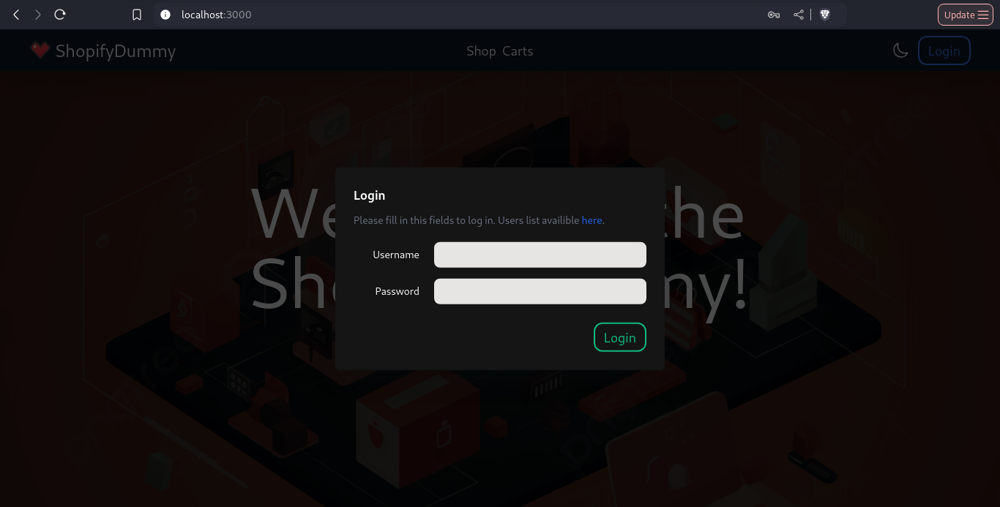
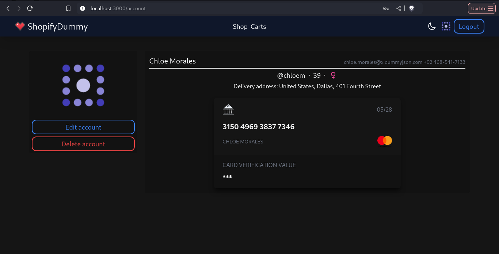
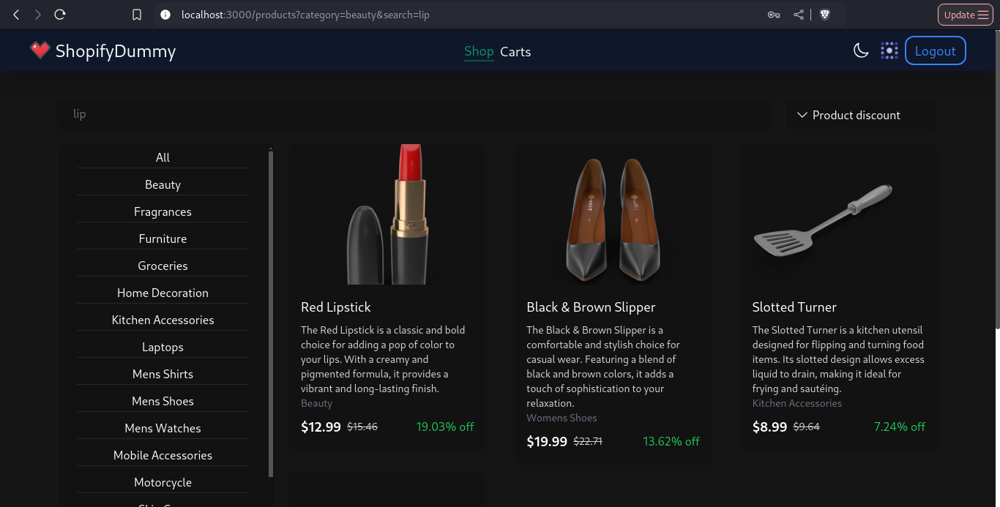
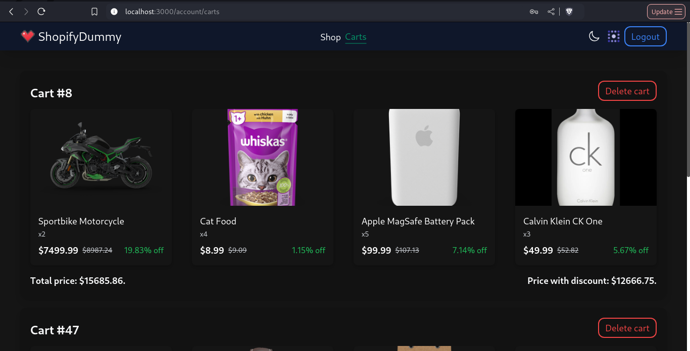

- [ShopifyDummy](#shopifydummy)
- [Установка](#установка)
    - [Клонирование репозитория](#клонирование-репозитория)
    - [Запуск контейнера](#запуск-контейнера)
- [Скриншоты](#скриншоты)
    - [Главная](#главная)
    - [Вход в аккаунт](#вход-в-аккаунт)
    - [Профиль](#профиль)
    - [Товары](#товары)
    - [Корзины](#корзины)
- [Лицензия](#лицензия)

# ShopifyDummy
__ShopifyDummy__ - Frontend клиент для фейкового онлайн магазина, базирующийся на __[https://dummyjson.com/](https://dummyjson.com/)__. 
Код написан на __[Nuxt.js](https://nuxt.com/)__, для стилизации использовались __[TailwindCSS](https://tailwindcss.com/)__ и 
__[SCSS](https://sass-lang.com/)__. Поддерживаются две темы.

## Установка
1. Клонируем репозиторий:

```cmd
git clone https://github.com/waflawe/shopify-dummy.git
cd shopify-dummy/
```
2. Поднимаем контейнер:
```cmd
docker-compose up
```
3. Клиент доступен на `http://localhost:3000`.

## Скриншоты

1. Главная:<br>
   
2. Вход в аккаунт:<br>
   
3. Профиль:<br>
   
4. Товары:<br>
   
5. Корзины:<br>
   

## Лицензия

У этого проекта [MIT лицензия](https://github.com/waflawe/shopify-dummy/blob/main/LICENSE).
